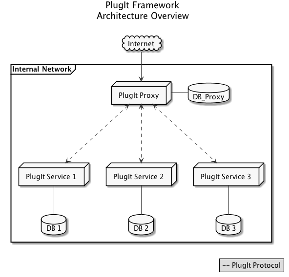

PlugIt
=======

`PlugIt` is a framework enhancing the portability and integration of micro-services requiring a user interface.

We use this framework at EBU to access services on the EBU.io platform. 

***This is a draft of the protocol and implementation. Expect issues (and report them) !***

## Introduction: Develop once, deploy many.
 
PlugIt is a framework which allows to combine multiple micro-services through a single experience and user interface while maintaining data and process isolation. 
It allows developers to design generic services and simply include common services such as User Management, Billing, Email notifications.
Services can easily be integrated in multiple environments. Using Bootstrap as basis for CSS styling, we can provide a unified User Experience across services. 
Global layout updates and core functionality can easily be updated across services.
In terms of availability, a broken service will not impact the others. 
Finally, it is possible to roll-out development environment and do shadow deployment per user.

## Documentation

* [Getting started](#getting-started)
* [Architecture overview](#architecture-overview)
* [Writing a PlugIt Service](./docs/new-plugit-service.md)
* [Framework](./docs/framework.md)
* [Protocol overview](./docs/protocol.md)

## Architecture overview

The framework is composed of two kinds of element:

1. **Services** Isolated and portable services providing generic features to the system.

2. **Proxy server**. It acts as the host platform. It provides User Authentication and common services such as email notifications, etc.

## Getting started

<!--
### New service

1. Install the plugit package:

  pip install plugit

2. Create a new service:

  #!/usr/bin/env python
  # -*- coding: utf-8 -*-
  
  import plugit
  import actions
  
  if __name__ == "__main__":
      plugit.load_actions(actions)
      plugit.app.run(host="0.0.0.0", debug=plugit.params.DEBUG, threaded=True)
-->

### Full Example

This example is a simple Voting application. Use the following command lines to start the example. 
(You will need to install [Docker](https://docs.docker.com/engine/installation/).

    cd examples
    docker-compose up -d
    open http://`docker-machine ip`:4000
    

The previous commands should have started two containers:
    
    $ docker ps
    CONTAINER ID        IMAGE                       COMMAND                  CREATED             STATUS              PORTS                    NAMES
    ??                  examples_standalone_proxy   "python manage.py run"   X minutes ago       Up X minutes        0.0.0.0:4000->4000/tcp   examples_standalone_proxy_1
    ??                  examples_simple_service     "python server.py"       X minutes ago       Up X minutes        0.0.0.0:5000->5000/tcp   examples_simple_service_1

#### PlugIt Proxy: Django client

The django client implements a standalone `PlugIt Proxy`. The implementation of the protocol is located in the `plugit` 
Django application and must be versioned in case of modifications in order to preserve backward compatibility. 
Use the following commands to run the proxy:

    cd examples 
    docker-compose up simple_service

#### PlugIt service: Flask server

The flask server implements a PlugIt service.

`server.py` is the main flask file, providing different calls to the framework, generated from actions defined in actions.py. 

Use the following commands to run the proxy:

    cd examples 
    docker-compose up standalone_proxy

## Core contributors

* Maximilien Cuony [@the-glu](https://github.com/the-glu)
* Michael Barroco [@barroco](https://github.com/barroco)
* Mathieu Habegger [@mhabegger](https://github.com/mhabegger)

## Copyright & license

Copyright (c) 2014-2016, EBU-UER Technology & Innovation

The code is under BSD (3-Clause) License. (see [LICENSE](./LICENSE))

