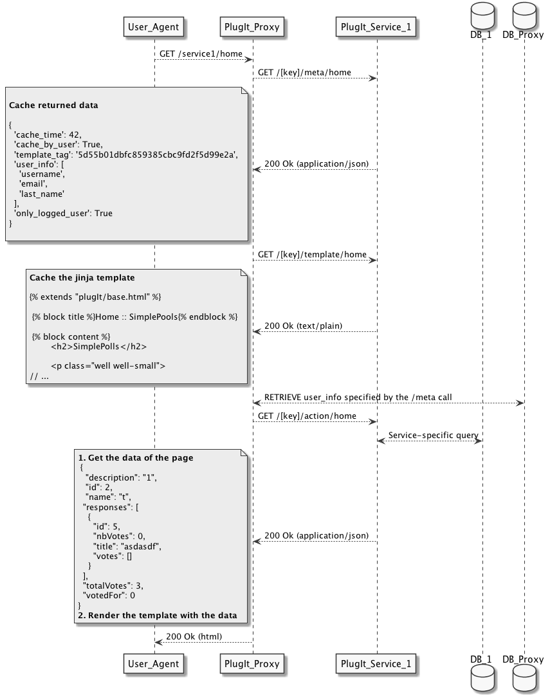

PlugIt Framework Protocol
=====

Each method returns a JSON object, except for /template/ and /media/ calls.

If you use the pip package, those methods are automatically implemented ! See the documentation [here](./plugit_service.md)

## Protocol overview

## Basic methods

### /ping [data=OptionalData]
/ping is used to test access to the application. The server must reply with an HTTP 200 response and the object {data: _OptionalData_} if everything is ok. The _OptionalData_ must be returned if provided, as send by the client or with a blank string if the parameter wasn't set.

### /version
/version is used to get the current version of the server API. The server must reply with an HTTP 200 response and the object {result: 'Ok', version: '1', protocol: 'EBUio-PlugIt'}, for the current version, if everything is ok.

### /mail
/mail is used by the PlugIt client to send back to the server mails reply from users. He will send back, using a POST request the response_id provided with the API call to send the mail. 

## Actions' methods
The project can define multiples actions, and they are triggered from the templates. There is no definition of the available actions.
The default action, called when the user arrive on the project page on EBUio is defined by a blank string. (root)

### /meta/_action_
This call returns information about a specific action. The server must reply with an HTTP 200 response (or a 404 if the action doesn't exist) with an object. Properties of this object are:

* template_tag : String. The current version of the template. This value must change if the template associated with the action change.
* json_only : Boolean. Optional, default to False. If set to True, return the json directly to the browser, without using a template.
* xml_only : Boolean. Optional, default to False. If set to True, return the xml directly to the browser, without using a template. (Requires {'xml':''} reply)
* no_template : Boolean. Optional, default to False. If set to True, return the template directly to the browser, without using a master template.
* public : Boolean, Optional, default to False. If set to True, the page is public even if the site runs in Orga Mode or other security
* address_in_networks: Array of network in which the remote ip must be to allow access to the page
* only_logged_user : Boolean. Optional, default to False. True if the user must be authenticated on EBUio to call the action.
* only_member_user : Boolean. Optional, default to False.  True if the user must be in the project group on EBUio to call the action.
* only_admin_user : Boolean. Optional, default to False.  True if the user must be an administrator of the project on EBUio to call the action.
* cache_time : Integer. Optional, default to 0. Time, in seconds, on how long the page should be cached on the EBUio side.
* cache_by_user : Boolean. Optional, default to _only_logged_user_ parameter. Set to true if the page must be cached by user. Useful if the page change based on the current user.
* user_info : List of string. Optional, default to []. List of user properties EBUio add to each request. Example properties, the full list isn't defined yet: username, email, first_name, last_name. NB: It's also possible to access this using the API.

The server should set the Expire: _Date_ HTTP header. EBIio will cache the result of the called based on this header. If this header isn't set, a timeout of 5 minutes will be used.

### /template/_action_
This call returns the template for a specific action (no JSON !). 200 HTTP status code must be used if everything is ok, or an HTTP 404 if the action doesn't exist.

### /action/_action_
This call execute on the server the specific action. If a POST method is used on the EBOio side, the request is done to the server using the same method, otherwise using GET.

POST data and URLs parameters are forwarded to the server side, including files, but parameters begging by ebuio_ are removed.

EBUio add to parameters (Using GET or POST data, depending of the method of the request) each parameter requested about the user in ebuio_u_<parameterName> parameters. One should be careful about lengths of those requests.

The server should reply with an HTTP 200 status code (or 404 if the action doesn't exist, 403 if the user hasn't right to call the action). The returned JSON object is forwarded to the template.

It's possible to redirect the client using the header `EbuIo-PlugIt-Redirect`. PlugIt automaticaly append the _ebuio_baseUrl_. To avoid this, set the header `EbuIo-PlugIt-Redirect-NoPrefix` to `True`.

It's possible to send a file using the header `EbuIo-PlugIt-ItAFile`. The content is send to the user, using the same content-type. If any, the Content-Disposition header is also forwarder.

### /media/_medianame_
This call return a specific media on the service side. Each request on EBUio side on /media/* is forwarded to the service and returned to the client. No caching is used, but a 1 hour Cache-Control header is set by EBUio-

## API

The API is available at /plugIt/ebuio_api/ . See the API root page using your browser for details.

A small python class (PlugItAPI) is available in plugit_api.py, methods are also detailled on the API root page.

### Mails

It's possible to send mail using the API. All users reply to the mail, if keeping the same subject, the response_id will be send back to the PlugIt service using the /mail call. The response_id is secured in the subject and can be trusted (users cannot generate generic response_id).

The management task check_mail is used to check mails and should be runned inside a cron job on the PlugIt Service. Relevent configuration (`INCOMING_MAIL` and `MAIL_SENDER`) should also be correct.

### ProxyMode

*ProxyMode* is a special mode and has main differences with normal PlugIt behavior.

In proxyMode, there is no rendering done by the PlugIt Proxy, and no methods (`/meta/`, `/template/`, `/action/`) to implement. The Proxy just forward the call from the user request to the service.

The PlugIt Service should send back the HTML content who will be displayed to the client. Except for the inclusion of the result inside the PlugIt webpage, nothing is else is done.

#### Parameters

The PlugIt Proxy will send information about the client and the request using HTTP headers. All headers begin by `X-Plugit-`.

#### CSRF

EBUio needs the presence of a CSRF token on each POST request (as implemented by django) for security issues.

The PlugIt Proxy parse the response of the PlugIt Service and replace the special token `{~__PLUGIT_CSRF_TOKEN__~}` by the current CSRF token.

If you want to make a post request, use the following snipet in your form:

`<input type="hidden" name="csrfmiddlewaretoken" value="{~__PLUGIT_CSRF_TOKEN__~}"/>`

#### Redirects

Redirect are handled as usual, using the `EbuIo-PlugIt-Redirect` header.

#### Medias

Medias are handled as usual, using the special `/media/` path.

#### No template

If you need to send back the result from the PlugIt service directly to the client, without a template, you can set the `EbuIo-PlugIt-NoTemplate` header (to any value).

### Session

It's possible to set value in the user session, using the `ebuio-plugit-setsession-<key>` header. The PlugIt Service will send back requests with the `X-Plugitsession-<key>` value.

Using the _standalone_proxy_ utils, it's possible to return a `PlugItSetSession` object, built with the value to return (who can be anything normal to return, like a PlugItRedirect or a standard dict) and a dict of key/value to set in the user session. The `get_session_from_request` helper function can also be used on a flask request object to extract a dict of key/value from the current user session.

